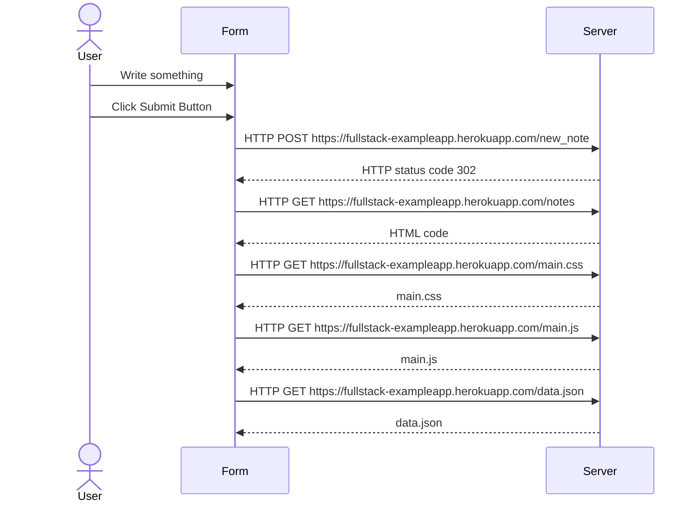

```mermaid
sequenceDiagram
Actor User
    User->>Form: Write something
    User->>Form: Click Submit Button
    Form->>Server: HTTP POST https://fullstack-exampleapp.herokuapp.com/new_note
    Server-->>Form: HTTP status code 302
    Form->>Server:  HTTP GET https://fullstack-exampleapp.herokuapp.com/notes
    Server-->>Form: HTML code
    Form->>Server:  HTTP GET https://fullstack-exampleapp.herokuapp.com/main.css
    Server-->>Form: main.css
    Form->>Server:  HTTP GET https://fullstack-exampleapp.herokuapp.com/main.js
    Server-->>Form: main.js
    Form->>Server:  HTTP GET https://fullstack-exampleapp.herokuapp.com/data.json
    Server-->>Form: data.json
```
